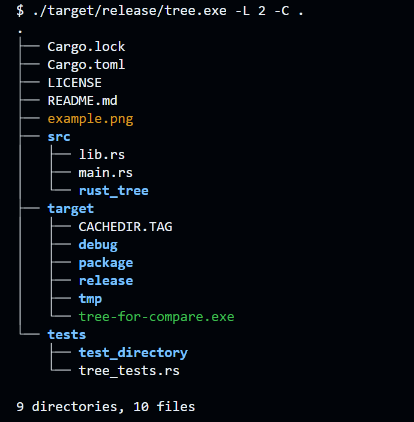

# tree

`tree` is a command-line utility that recursively displays the directory structure of a given path in a tree-like format, inspired by the Unix `tree` command. It is implemented in Rust and aims to provide a fast and efficient alternative with additional features.



## Features

- [x] Display directory structure in a tree-like format
- [x] Control the depth of recursion with the `-L` or `--level` flag
- [x] Show full path with the `-f` or `--full-path` flag
- [x] Colorize output with the `-C` flag
- [x] No indentation with the `-I` or `--no-indent` flag
- [ ] Display hidden files with the `-a` or `--all` flag
- [ ] Include or exclude specific file patterns with the `-P` flag
- [ ] Display the size of each file with the `-s` or `--size` flag
- [ ] Display the total size of each directory with the `-h` or `--human-readable` flag
- [ ] Other advanced features

## Installation

### Download Binaries

Binaries for various platforms are available on the [GitHub Releases](https://github.com/peteretelej/tree/releases) (Windows, MacOS, Linux) page.

### Build from Source

If you have Rust and Cargo installed, you can build the project by running:

```sh
git clone https://github.com/peteretelej/tree.git
cd tree
cargo build --release
```


The resulting binary will be located at ./target/release/tree.

## Usage 
```sh
tree [FLAGS] [OPTIONS] [PATH]
```

## Contributing
Contributions are welcome! If you have any suggestions, feature requests, or bug reports, please feel free to open an issue or submit a pull request on the GitHub repository.

## License
This project is licensed under the MIT License.